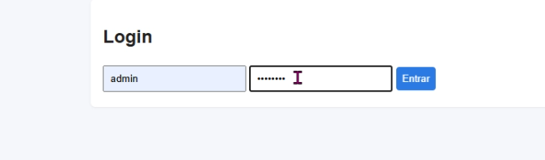
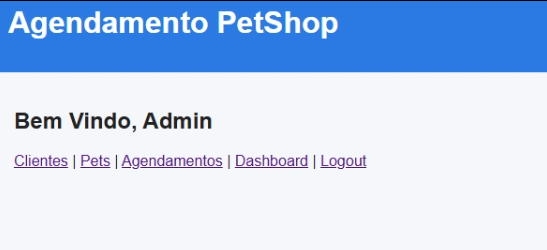
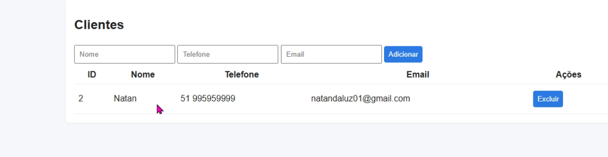
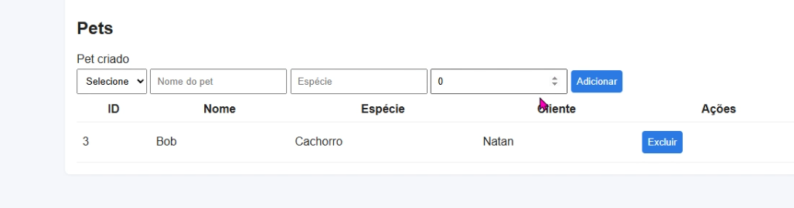
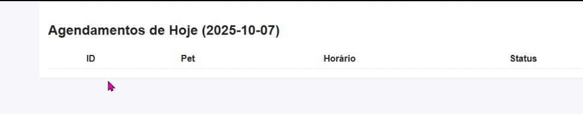
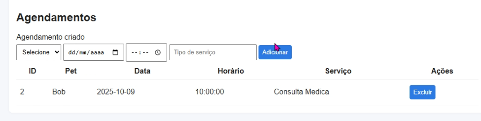

## Sistema de Agendamento para Pet Shop (v1)

Sistema web de agendamento desenvolvido em PHP e MySQL para pet shops e clínicas veterinárias, com foco em organização operacional, controle de clientes e gestão eficiente de atendimentos.

---

## 🎯 Proposta do Projeto

Centralizar e estruturar o fluxo de atendimentos em estabelecimentos do setor pet, reduzindo conflitos de agenda e aumentando a previsibilidade operacional.

**Benefícios principais:**

* Organização centralizada dos agendamentos
* Redução de conflitos de horários
* Controle estruturado de clientes e pets
* Melhor visibilidade da rotina operacional

---

## ⚙️ Funcionalidades

* Autenticação de usuários com controle de sessão
* CRUD completo de clientes
* Cadastro e gestão de pets vinculados aos clientes
* Agendamento de atendimentos com associação de serviços
* Dashboard com visão diária de atendimentos
* Prevenção de conflitos de horários

---

## 🏗️ Arquitetura / Estrutura

Estrutura modular com separação clara de responsabilidades:

* **Aplicação** → rotas e fluxo principal
* **Banco de dados** → conexão e scripts SQL
* **Helpers** → autenticação, CSRF e utilidades
* **Scripts** → automação e suporte ao ambiente

**Estrutura de diretórios em pastas :**

```bash
AgendamentoPetShop/
├── index.php
├── login.php
├── logout.php
├── clientes.php
├── pets.php
├── agendamentos.php
├── dashboard.php
│
├── db/
│   ├── conexao.php
│   └── criar_tabelas.sql
│
├── helpers/
│   ├── auth.php
│   ├── csrf.php
│   └── flash.php
│
└── scripts/
    ├── create_db.php
    ├── reset_admin_password.php
    ├── run_smoke_suite.php
    └── setup-dev.ps1
```

---

## 🔐 Segurança Aplicada neste projeto

* Hash seguro de senhas com `password_hash()`
* Prepared statements com `mysqli` para mitigação de SQL Injection
* Proteção CSRF em formulários
* Escapamento de saída com `htmlspecialchars()`
* Controle de sessão para autenticação

---

## 🧰 Stack do Projeto

* _PHP 7.4+_
* _MySQL / MariaDB_
* _mysqli_
* _HTML5_
* _CSS3_
* _Javascript_

---

## 🚀 Instalação Para Rodar o Projeto

### Pré-requisitos

* PHP 7.4+
* MySQL ou MariaDB
* Ambiente local (XAMPP, WAMP ou similar)

## Passos

1. Clonar o repositório
2. Criar o banco de dados
3. Executar o script SQL
4. Configurar a conexão com o banco
5. Iniciar o servidor local

## Execução rápida

```bash
git clone https://github.com/NatanLuz/AgendamentoPetShop.git
cd AgendamentoPetShop

php scripts/create_db.php
php -S localhost:8080
```

## Acesse no navegador:

```
http://localhost:8080/login.php
```

## **Credenciais padrão:**

* Usuário: `admin`
* Senha: `admin123`

> Recomenda-se alterar a senha após o primeiro acesso.

---

## 🧪 Testes Rápidos

**Checklist funcional:**

1. Realizar login
2. Cadastrar cliente
3. Cadastrar pet
4. Criar agendamento
5. Visualizar no dashboard
6. Validar bloqueio de acesso sem login

---

## 📸 Screenshots Do Projeto

<p align="center">
  
  <br>
  
  <br>
  
  
</p>

---

## 👤 Autor

**Natan Da Luz**
Desenvolvedor Backend focado em PHP
